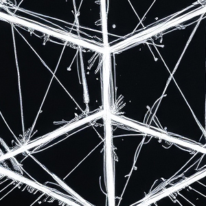
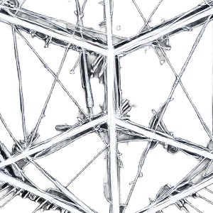
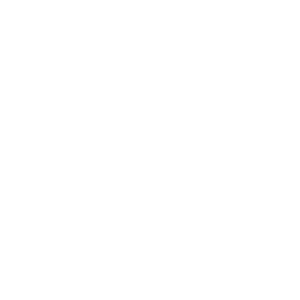

 

	
	

	
	

	

	

	<h1>Best Project</h1>
	<h3>Have you encountered this issue before?</h3>
	<h4>I converted a JPG image to PNG using Photoshop and AI tools, but the quality wasn't clear.</h4>
	
	
	
	<h4>However, if you use this image-converter API, you can achieve a clearer conversion!</h4>
	
	
	
	<a href="https://image-converter-api-one.vercel.app/swagger/index.html">Give it a try!</a>

